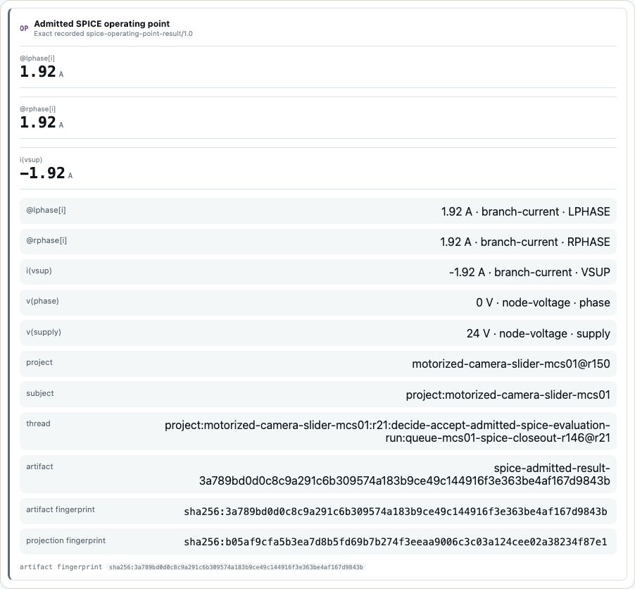

# mcp-spice

`mcp-spice` runs bounded ngspice analyses behind MCP and keeps every result tied to the
exact circuit bytes that produced it.

[JSR](https://jsr.io/@casys/mcp-spice) ·
[container](https://github.com/Casys-AI/mcp-spice/pkgs/container/mcp-spice) ·
[technical documentation](docs/README.md) · [changelog](CHANGELOG.md) ·
[security](SECURITY.md)



_A read-only MCP App projecting an exact recorded operating-point artifact from a
Digital Thread project. The values, units, source symbols, artifact identity, and
projection fingerprint all come from the recorded result._

## What it provides

- Content-addressed admission for exact UTF-8 circuit netlists.
- Bounded operating-point, transient, and DC-sweep analyses through ngspice.
- Compact structured results instead of unbounded raw curves.
- Immutable documentary receipts and exact result readback across restarts.
- Small MCP Apps for a result or receipt, built from shared MCP View components.

The server reports numerical observations and declared analysis limits. It does not
decide whether a circuit satisfies a requirement, and a successful execution is not a
proof or compliance verdict.

## Run it

The published container includes Deno and ngspice. Its default command starts the HTTP
transport on port `3023`:

```bash
docker run --rm \
  -p 127.0.0.1:3023:3023 \
  -v mcp-spice-runs:/ngspice-runs \
  ghcr.io/casys-ai/mcp-spice@sha256:e5bcf112ec37d71d9a02dfcb1c65af0ed77fe497e97e16e931bfb6baa0dd367d http
```

The MCP endpoint is `http://127.0.0.1:3023/mcp`. Native stdio is available from the same
image:

```bash
docker run --rm -i \
  -v mcp-spice-runs:/ngspice-runs \
  ghcr.io/casys-ai/mcp-spice@sha256:e5bcf112ec37d71d9a02dfcb1c65af0ed77fe497e97e16e931bfb6baa0dd367d stdio
```

To run the published JSR module, install `ngspice` on the host, then use the exact
version:

```bash
deno run --allow-all jsr:@casys/mcp-spice@0.6.2/server --stdio
```

For local development:

```bash
deno task serve
```

## The normal flow

Submit the exact circuit text, keep the returned SHA-256 reference, then request the
analysis using that reference and explicit observables. Simulation responses include the
input identity, bounded readings, declared `not_checked` limits, and a documentary
receipt reference.

Details and complete examples live in the repository documentation:

- [Installation and transports](docs/getting-started.md)
- [MCP API and content-addressed workflow](docs/api.md)
- [MCP Apps and recorded viewer sessions](docs/viewers.md)
- [Durable receipts and recovery](docs/durable-records.md)
- [Runtime limits and security model](docs/security.md)
- [Development and release gates](docs/development.md)

## Digital Thread boundary

`mcp-spice` owns circuit execution and its presentation contracts. Casys Digital Thread
may record and display those exact artifacts, but its Workbench remains a read-only
projection: it does not choose provider arguments, call ngspice, or reinterpret a
documentary result as an engineering decision.

## License and citation

The source is licensed under [MIT](LICENSE). Citation metadata is available in
[CITATION.cff](CITATION.cff).
